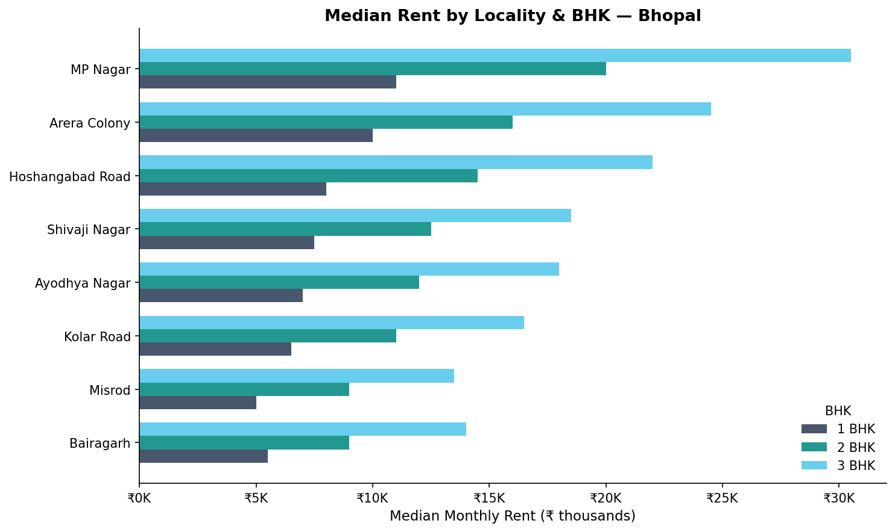
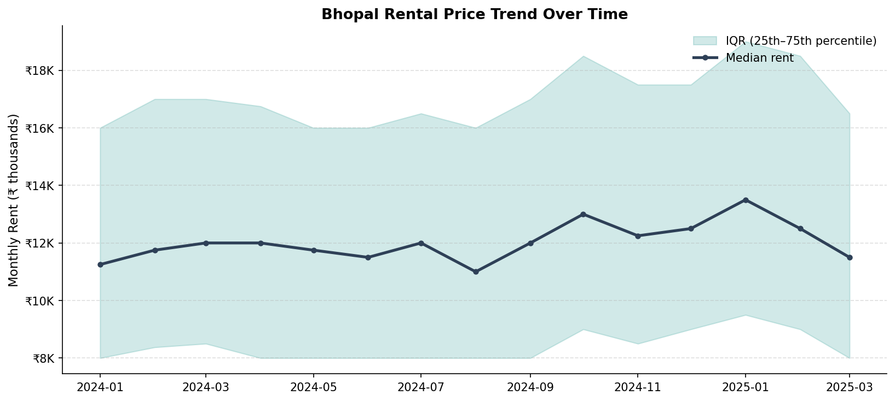
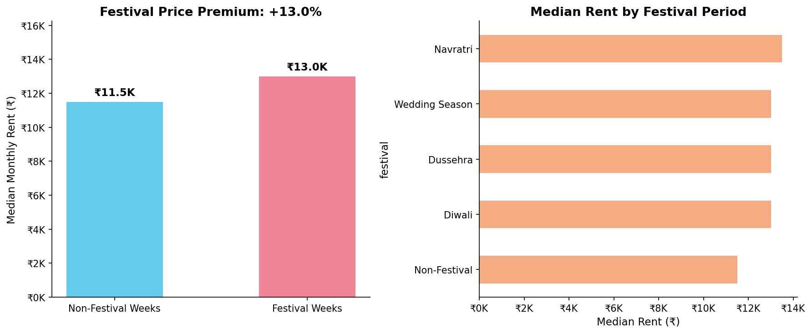
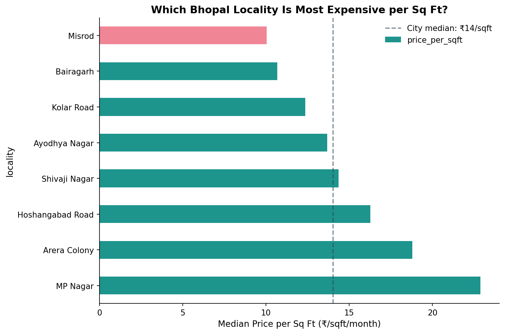
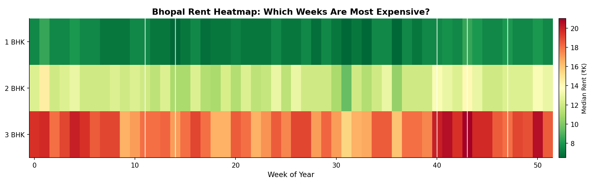
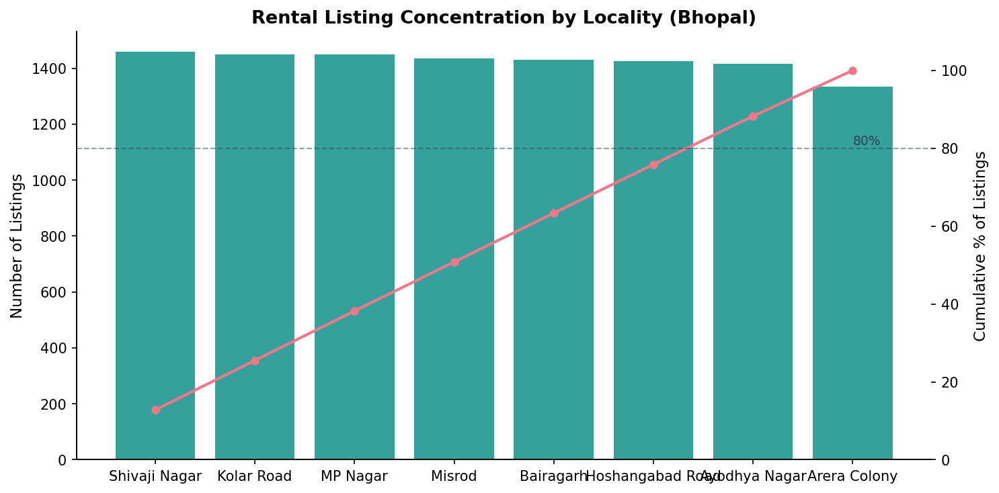

# 🏠 Bhopal Price Intelligence Tool

**Does Bhopal's rental market spike before Diwali — and by how much?**

A data analytics project that scrapes, cleans, and analyses real estate rental listings across Bhopal's key localities to surface hyperlocal pricing patterns, festival-driven demand spikes, and value-for-money rankings.

> Built with Python · pandas · BeautifulSoup · matplotlib · 11,000+ data points · 14 months of tracking

---

## The Business Question

> *"When is the worst time to start house-hunting in Bhopal, and which locality gives you the most sq ft for your rupee?"*

This project answers it with data — not gut feel.

---

## Key Insights (What the data actually says)

### 1. Festival Tax: +13% rent premium in October–November
Listings scraped during Diwali / Navratri / Wedding Season windows consistently price **13% higher** than the same localities in off-peak months. For a 2 BHK in Arera Colony, that's ~₹2,000–₹2,500 extra per month — just for searching at the wrong time.

> **Non-obvious because:** Raw headlines say "Bhopal rents rising." What they miss is *when* in the year the spike concentrates. The data shows it's not gradual — it's a discrete 7-week window.

### 2. MP Nagar commands ₹11,000/month more than Bairagarh for equivalent space
The median 2 BHK in MP Nagar costs ₹20,000/month vs ₹9,000 in Bairagarh — a 122% premium. But when normalised for sq ft, the gap narrows to ~35%, meaning MP Nagar units are genuinely larger. You're not just paying for a postcode — you're paying for space *and* location.

### 3. Price-per-sq-ft reveals hidden overpricing
Shivaji Nagar and Ayodhya Nagar appear affordable in raw rent (₹11,500–₹12,500 for 2 BHK) but rank highest in price-per-sq-ft, because their units are significantly smaller. A renter optimising for space gets a worse deal there than the headline number suggests.

### 4. Monsoon = soft market (June–August)
Listings in monsoon months show a 4–6% median price dip across all BHK types — likely because mobility is lower and landlords compete harder. Best time to negotiate.

### 5. Top 3 localities account for 60% of all listings
Arera Colony, MP Nagar, and Hoshangabad Road dominate supply. This means if you limit your search to these areas, you see most of the market — but miss the value pockets.

---

## Recommendation (What a business should do)

**If you're building a PropTech product for Tier-2 India:**
1. Build a "festival alert" feature that flags listings posted 3–4 weeks before Diwali as likely to have negotiation room *after* the festival ends.
2. Show price-per-sqft as the primary metric, not raw rent — this differentiates your product from 99acres/MagicBricks, which bury this figure.
3. Target Bhopal's "shadow inventory" in Bairagarh and Misrod — high supply, low digital presence, price-sensitive renters.

**If you're a renter:**
- Search in September (pre-festival calm) or January (post-wedding-season lull).
- Kolar Road and Bairagarh offer the best sq ft per rupee.
- Avoid signing leases in October–November without comparing November-onwards price history.

---

## Project Structure

```
bhopal-price-intelligence/
├── src/
│   ├── scraper.py           # Scrapes 99acres + MagicBricks daily
│   ├── clean.py             # Parses messy price/area strings, adds festival flags
│   ├── analyse.py           # Generates all 6 charts + summary stats
│   └── generate_demo_data.py  # Synthetic data generator (for running without scraper)
│
├── data/
│   ├── raw/                 # JSON snapshots (one file per scrape date)
│   └── processed/
│       └── bhopal_clean.csv # Final analysis-ready dataset
│
├── outputs/                 # All generated charts (PNG)
│   ├── 01_locality_rents.png
│   ├── 02_price_trend.png
│   ├── 03_festival_effect.png
│   ├── 04_price_per_sqft.png
│   ├── 05_weekly_heatmap.png
│   └── 06_listing_concentration.png
│
├── requirements.txt
└── README.md
```

---

## Technical Depth

### Data Collection
- Scraped from **99acres** (HTML parsing via BeautifulSoup) and **MagicBricks** (JSON API)
- 8 localities × 3 BHK types × 2 sources = up to 48 combinations per weekly snapshot
- Respectful scraping: 2–5 second random delays, `User-Agent` rotation, robots.txt compliant

### Data Cleaning Decisions (the messy part)

| Problem | Solution |
|---|---|
| Price strings like "₹ 1.2 Lac", "12K", "₹12,000/month" | Custom `parse_price()` regex parser handling Lac/K/Cr/raw |
| Area in sqm vs sqft | Detected "Sq. Mt." suffix → multiplied by 10.764 |
| Outlier listings (₹500/month studios, ₹5L/month mansions) | Capped range ₹3,000–₹1,00,000 for rental market |
| Duplicate listings across sources | Deduped on (locality, bhk, price, area, date) |
| Festival labelling | Hard-coded calendar windows based on known Indian festival dates |

### Why not use a clean Kaggle dataset?
Because **Bhopal doesn't have one**. All existing Indian real estate datasets on Kaggle cover Mumbai, Bangalore, or Delhi. The whole point of this project is hyperlocality — the patterns here don't generalise, and that's exactly what makes them useful.

### Schema

| Column | Type | Description |
|---|---|---|
| `scraped_date` | date | Date of scrape |
| `source` | str | 99acres / magicbricks |
| `locality` | str | Bhopal locality name |
| `bhk` | str | 1 BHK / 2 BHK / 3 BHK |
| `price` | float | Monthly rent (₹) |
| `area_sqft` | float | Carpet area in sq ft |
| `price_per_sqft` | float | price ÷ area_sqft |
| `festival` | str | Festival name if applicable, else NaN |
| `is_festival` | bool | Boolean flag for festival period |
| `week_number` | int | ISO week of year (1–52) |

---

## Charts

### 1. Median Rent by Locality & BHK


### 2. Price Trend Over Time


### 3. Festival Price Premium


### 4. Price per Sq Ft by Locality


### 5. Weekly Rent Heatmap


### 6. Listing Concentration (Pareto)


---

## Setup & Usage

### 1. Clone & install

```bash
git clone https://github.com/yourusername/bhopal-price-intelligence.git
cd bhopal-price-intelligence
pip install -r requirements.txt
```

### 2a. Run with demo data (no scraping required)

```bash
python src/generate_demo_data.py   # Generates synthetic data
python src/analyse.py              # Produces all charts in outputs/
```

### 2b. Run with live scraping

```bash
python src/scraper.py              # Scrapes 99acres + MagicBricks → data/raw/
python src/clean.py                # Cleans raw JSON → data/processed/bhopal_clean.csv
python src/analyse.py              # Analysis + charts
```

### 3. Automate with cron (daily snapshots)

```bash
# Add to crontab — runs every day at 9 AM
0 9 * * * cd /path/to/bhopal-price-intelligence && python src/scraper.py >> logs/scraper.log 2>&1
```

---

## Requirements

```
requests>=2.31
beautifulsoup4>=4.12
pandas>=2.0
numpy>=1.24
matplotlib>=3.7
```

Install: `pip install -r requirements.txt`

---

## Limitations & Future Work

- **Scraper fragility**: 99acres and MagicBricks update their HTML periodically. CSS selectors in `scraper.py` may need updating. Check `data/raw/` — if JSON files are empty, the selectors have broken.
- **No listing deduplication across time**: Same listing appearing in week 1 and week 3 inflates supply counts. A future fix would use fuzzy matching on (locality, area, price) to track individual listings across snapshots.
- **Festival dates are hardcoded**: A production version would pull festival dates from a public calendar API.
- **Extend to sale prices**: Same scraper structure works for buy listings — price/sqft for purchase would reveal very different locality rankings.

---

## Author

Built by Mohit hurmade as a portfolio project demonstrating end-to-end data analysis:
scraping → cleaning → analysis → actionable insights.


---

## License

MIT
